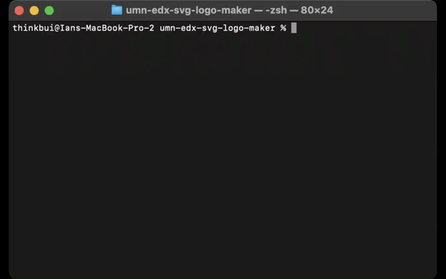

# umn-edx-svg-logo-maker

## SUMMARY
This is a simple, command line app that generates a basic SVG logo that could be used for different apps including web apps.  You can pick the text (up to 3 characters), the shape (circle, triangle, rectangle), and colors for each (keyword or hex).

The logo can be output to a file named *output.svg* or printed to the console.

## INSTALLATION & USAGE
This project is built with Node.JS.  You will need to have that installed before you begin.
1. Clone the project to your machine.
2. From your terminal, run 'npm install'.
3. To run the project, run 'node index.js'.

## NOTES
The colors are hardcoded in at the moment, so only certain colors are available.  The rest of the colors supported in SVG may be added later.

## DEMOS
Below are animations demonstrating the usage of this project.  They are also available as WEBM and MP4 videos in this repository.

Generating to file:

Generating to console:

## TESTS
The project comes with a limited test suite.  It can be executed from your terminal by running 'npm run test'.

The complete test suite passing:

